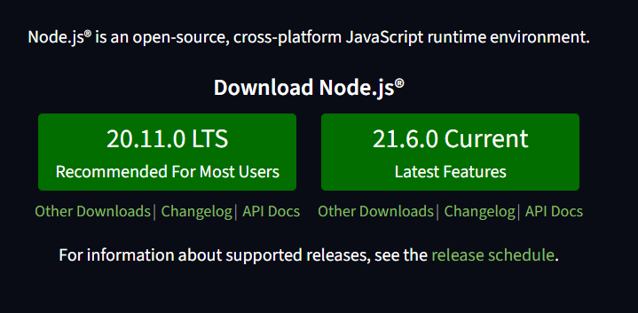
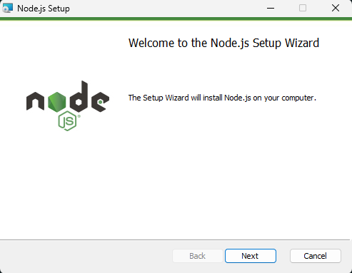
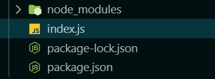
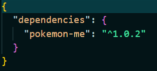

# Aula de React Native e EXPO

Este repositorio tem como objetivo apenas o entendimento do que eh o React Native, Expo, NPM, NPX, NODE, e seus agregados. Para ela eh interessante ja ter previamente utilizado uma linguagem de programacao (tanto faz qual seja). De resto, os conteudos apresentados sao as mostradas no **INDEX**

## INDEX

```txt
1. INSTALACAO NODE JS
    1.1 O que eh NodeJS?
    1.2 Utilizacao Node
    1.3 Utilizacao Npm e Npx

2. INSTALACAO EXPO
    2.1 O que eh o Expo e o React Native?
    2.2 Comandos do Expo
    2.3 Estrutura de Pastas
    2.4 Componentes
    2.5 Estilizacao

3. UTILIZACAO DE EXPO ROUTES
    3.1 Instalacao Expo
    3.2 Estrutura de Pastas
    3.3 Utilizacao do Expo Routes
```

---

Espero que aproveitem de algo :P
Videos serao adicionados ao decorrer do desenvolvimento desta documentacao, qualquer duvida soh mandar um

[ ] Instalacao NodeJS e Utilizacao

[ ] Instalacao Expo

[ ] Utilizacao do Expo Routes

## 1. INSTALACAO NODE JS

Para o tutorial de Node, iremos considerar que esta utilizando o Windows, 11, ou 10.

*caso esteja no linux, parabens, acho que consegue se virar, entao boa sorte, eh mais simples do que para o windows, acredite.*

---

1.

> De inicio abra o site de download do Node: [link](https://nodejs.org/en)

---

2.

> dois botoes irao aparecer, um para a versao LTS (long term suport) e a current, a mais nova, para nosso proposito a LTS sempre sera a mais indicada, visto que utilizaremos em conjunto com *libs* que sao dependentes do node



*libs:* sao as bibliotecas, e no nosso caso utilizaremos um *framework* para desenvolver nossos aplicativos

*framework:* sao um conjunto de *libs*

---

3.

> Ao clicar no botao LTS ele ira iniciar o download automaticamente.

---

4.

> Agora eh instalar normalmente!!

> Apenas um next next finish padrao :P

---

**pronto node instalado, agora, eh bom reiniciar o computador viu :P**

### 1.1 O que eh NodeJS?

como no proprio site dele diz:

> As an asynchronous event-driven JavaScript runtime, Node.js is designed to build scalable network applications.

como assim? um runtime JS?

Contando um pouco de historia, o JavaScript originalmente era executado apenas dentro no navegador, de forma a coletar dados, executar comandos, deixar a internet mais *dinamica* colocaremos assim.

Deste modo, um tempo depois, como todo bom ser humano, uma pessoa olho isso e falou: *"hum, linguagem versatil, facil, portavel e simploria (quando se tratando de sintaxe, para a epoca) por que nao rodar ele como backend?"*

**obs:** mal essa pessoa sabia, que anos depois essa solucao seria a mais utilizada em todo meio de desenvolvimento, e que uma frase "linda" seria criada com essa informacao, e qual? **"Tudo eh possivel ser feito com JS, se nao feito em JS, um dia alguma criatura ira fazer em JS"**

hoje em dia outros runtimes JS fora do navegador existem, ate mais rapidos que o node, como o Deno, Bun, Pkg. Eh ate um exercio deixar de usar o Node e passar a usar outros, segue um artigo que achei interressante em vez de usar o node usar o Bun para o mesmo proposito desse tutorial [link](https://medium.com/@sisongqolosi/how-to-speed-up-your-react-native-development-with-bun-88099cc28e92)

### 1.2 Utilizacao Node

Node eh basicamente um interpretador, deste modo, ele interpreta o codigo JS que voce escrever. Apenas isso. Entretanto, como uma boa linguagem, pessoas criam outros codigos para ela, as chamadas libs e tambem criam ferramentas para facilitar nossa vida, os chamados frameworks.

Para fazer sua utilizacao "crua" basta estar executando o JS pelo proprio terminal

---

1. crie uma pasta para o projeto


---

2. dentro da pasta abra um terminal e crie um arquivo chamado `index.js`

---

3. agora escreva um pequeno codigo falando para o JS printar uma coisa na tela, cole essas linhas de codigo a baixo no seu arquivo:

```js
function printandoAlgo() {
    console.log('Hello, pessoa bonita que me utilizou <3\n \033[1;35m Porque estava achando que ia aparecer outra coisa?\n \033[m Esperava um hello world? \033[1;31m nahhh ja viu de mais isso \033[m');

    console.log('\n\n\033[5;7meste codigo esta sendo interpretado pelo Node :P parabens\033[m');
}

console.log('\033[32mchamando a funcao: \033[m');
printandoAlgo();
```

*brincadeiras a parte :P*

---

4. agora dentro do diretorio do arquivo, o execute com o comando:

```sh
node ./index.js # leve em conta que o ./index.js eh o nome do arquivo, e pode ser alterado de acordo com o programa que estiver utilizando/fazendo :P enfim, isso aqui eh soh um comentario, nao sera executado no seu terminal
```

*bem agora sabe oq eh o node, agora, o node pelo node nao eh muito util, a nn ser que queira apanhar muito para fazer todo o seu codigo do zero, entretanto outras pessoas ja fizeram muito por voce, inclusive **scripts** para facilitar a tuilizacao no node e do JS no geral, agora, isso eh para nossa proxima sessao <3*

### 1.3 Utilizacao Npm e Npx

> ok, agora que entendemos o que eh o node e vimos como utilizar, vamos ver algumas coisinhas que vem junto com o node.

**npm**: eh o gerenciador de pacotes do node, como uma distribuicao linux, a maioria das linguagens modernas vem com um gerenciador de pacotes, considere pacotes, como um bocado de linhas de codigo que uma pessoa escreveu para voce, considere, talvez, um programa? quem sabe, nao passa disso. Mais para frente veremos como npm faz isso na pratica

**npx**: eh um executor de *scripts*. Como assim? 

(1) ele vai executar coisas que pessoas fizeram para voce previamente

(2) ele vai baixar pacotes, executar algumas CLI's e facililitar sua vida como um todo

(3) alguem criou um script (igual ao nosso no exemplo de como usar o node) e jogou na internet, o Npm, pegou esse script e colocou dentro do [banco de dados](https://docs.npmjs.com/searching-for-and-choosing-packages-to-download) do proprio npm e agora voce pode executar em sua maquina

*muita info?* eh eu sei, mas, acho interessante salientar esses pequenos pontos

---

como exemplo utilizaremos um pacote chamado `pokemon-me` ele vai gerar um pokemon e printar na tela, coisinha simples ^^ o codigo e pacote se entram [nesse link](https://www.npmjs.com/package/pokemon-me?activeTab=readme)

---

1. dentro do diretorio do exemplo, abra um terminal e rode o seguinte comando:

```sh
npm i pokemon-me
```

vemos que ele cria toda uma estrutura de pastas presentes em aplicacoes que utilizam o node



* `package-lock.json`
  * sao os diretorios e configuracoes dos modulos em questao, como a url que ele deve procurar o modulo, o diretorio onde ele vai instalar o modulo, e assim por diante

* `package.json`
  * sao as dependencias que voce instalou, se abrir esse aquivo ira ver, provavelmente, algo assim:
  
  * indica para o node e o npm da maquina os modulos que devem ser instalados se, caso, o programa tenha de ser reinstalado, ou instalado em outra maquina (para nao ficar dependende dos aquivos dentro do `node_modules`)

* `node_modules`
  * sao as pastas e codigos necessarios para os pacotes estarem rodando. Quando se instala um pacote ele vai direto para o node_modules
  * quando voce cria um repositorio no github ou em qualquer outro repositorio de codigo, nao eh interessante adicionar o `node_modules` pois ocupa muito espaco, e sempre que rodar o `npm run` ou `npm install` ele ira procurar pelos modulos faltantes e instalara em sua maquina <3 *veremos tudo isso mais para frente*

acho que ta bom de teoria :P vamos praticar

---

2. agora que feita a instalacao do pacote voce precisa importar dentro do seu arquivo, cole isso no topo do arquivo:

```js
const pokemonMe = require('pokemon-me'); // este jeito de importar coisas foi depreciado, hoje em dia usamos outro jeito que veremos mais para frente, mas como esse pacote eh um pouco antigo, relevemos, e utilizaremos do mesmo jeito,
```

---

3. a chamada da funcao ira variar de pacote para pacote, eles podem ser objetos por exemplo, e a chamda seria `nome_do_pacote.funcao_ou_variavel_que_deseja_chamar_do_pacote` mas isso voce pode ver dentro da documentacao do pacote ou pesquisando quando for usar

```js
// no caso do pokeme eh soh chamar o nome do pacote, pois esse ja eh a propria funcao
//pokemonMe();
// entretanto para printar algo na tela
console.log(pokemonMe());
```
*quando se trata da utilizacao de pacotes eh muita pesquisa, pois muitos sao depreciados, poucos usados, e as vezes nem funcionam em alguns disposivos, por isso, fique atento, converse com a equipe, ou utilize apenas os pacotes ja importados e documentados pelo fremework que esta utilizando*

---

4. o codigo "final" do exemplo ficou assim, copie e cole e estude o codigo um pouco, brinque um pouquinho

```js
const pokemonMe = require('pokemon-me')

function printandoAlgo() {
    console.log('toma um pokemon ^^')
    console.log(pokemonMe())
}

console.log('\n\n\033[32mChamando a funcao: \033[m');
printandoAlgo();
```

---

agora vimos como fazer a importacao de libs/pacotes vamos utilizar VARIOS, utilizando assim um framework. Deste modo, faremos um app na pratica, apenas para efeito de teste ^^